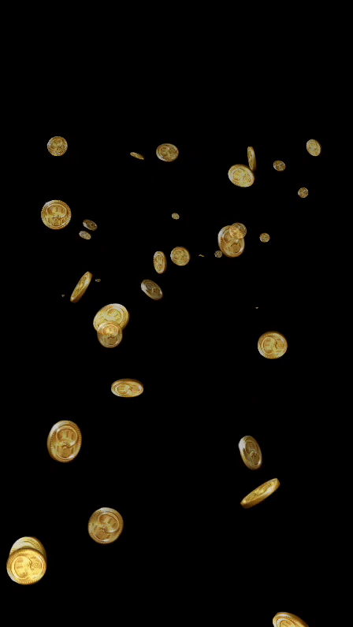

# Particle System Project

This project is a JavaScript-based particle system using PIXI.js for creating animated particles. It provides a configurable system for
generating particle animations.



## Table of Contents

-   [Introduction](#introduction)
-   [Documentation](#documentation)
-   [Installation](#installation)
-   [Usage](#usage)
-   [Configuration](#configuration)
-   [Particle Controller](#particle-controller)
-   [Textures Controller](#textures-controller)
-   [Coins Model](#coins-model)
-   [License](#license)
-   [Attribution](#attribution)

## Introduction

The Particle System Project is a JavaScript project that uses PIXI.js for creating particle animations. It allows you to configure various
aspects of the particle system, including textures, animation behavior, and more.

## Documentation

The documentation for this project can be found in the [docs](./docs) folder. It contains the following files:

-   [index](./docs/index.html): The main documentation page
-   [config](./docs/global.html): Documentation for global variables
-   [stageController](./docs/StageController.html): Documentation for the StageController class
-   [particleController](./docs/ParticleController.html): Documentation for the ParticleController class
-   [texturesController](./docs/TexturesController.html): Documentation for the TexturesController class
-   [coinsModel](./docs/CoinsModel.html): Documentation for the CoinsModel class

## Installation

To get started with this project, follow these steps:

1. Clone the project repository to your local machine:

```bash
Copy code
git clone https://github.com/your/repo.git
```

## Usage

To use the Particle System, you can integrate it into your JavaScript application. Here's a basic example of how to set up the particle
system using the provided configuration:

```javascript
Copy code
import { config } from './config/config.js';
import { StageController } from './Controllers/StageController.js';

window.onload = () => {
    let stage = new StageController(config.stageSize.width, config.stageSize.height);
    stage.init(config.textures, config.particleModelOptions);
};
```

You can customize the config.js file to adjust the particle system's behavior to your requirements.

## Configuration

The config.js file contains the configuration options for the particle system. You can modify the following aspects:

-   Stage size
-   Textures for particles
-   Particle model options

For a detailed explanation of the configuration options, refer to the comments in the config.js file.

## Particle Controller

The ParticleController class is responsible for creating and managing the particle system. It takes the PIXI application, textures, and
options as parameters. The particle system's animation behavior can be configured in this class.

## Textures Controller

The TexturesController class manages the textures used in the particle system. It can either use textures in random order or in a specific
order (ascending or descending).

## Coins Model

The CoinsModel class represents the model for coins in the game. It allows you to configure various parameters for the coin animation, such
as alpha values, speed, lifetime, and more.

## License

This project is licensed under the MIT License - see the [LICENCE](LICENCE.txt) file for details.

### Attribution

If you use this project in your own work, please include proper attribution to the original author (e.g., "This project is based on "Coins
Shower" by [Anoerak](https://github.com/Anoerak), licensed under the MIT License.").
